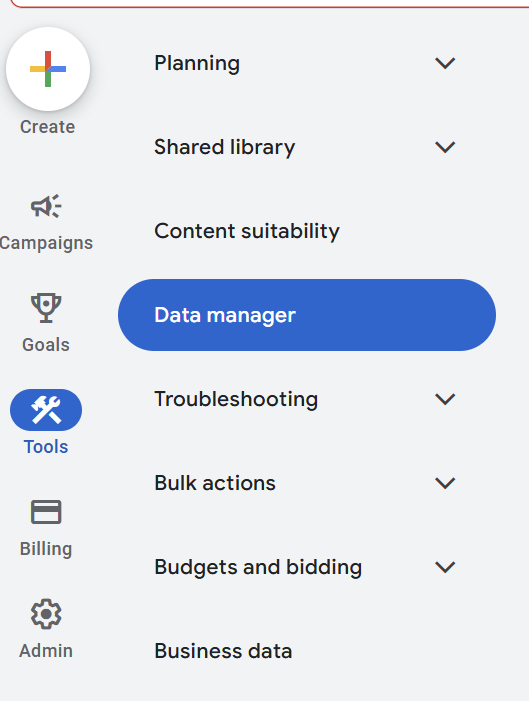
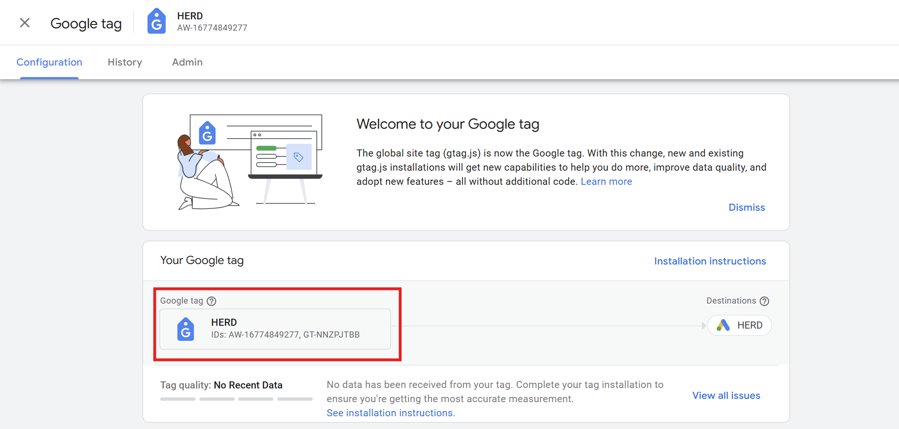

:::info Understand how to grab the <b>Tracking ID</b> first, it was the hardest thing to find on the internet. :::

## How to Retrieve the Google Tracking ID

### What is the tracking ID:
    its used to connect google ads to your site.

### Steps to get the ID.
    1. Go to the Google Ads account.
    2. Click on the Tools Icon.
    3. Click Data Manager.
        
    4. Under Google Tag - click on "manage"
        
    5. Click the Google Tag.
        
    6. Now you will be able to see the google tag details.
        
    7. Copy the Destination ID.

    There you have it.