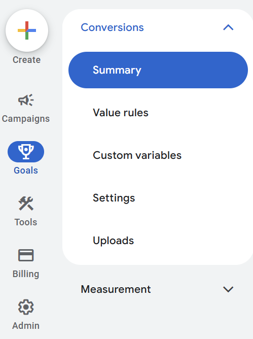
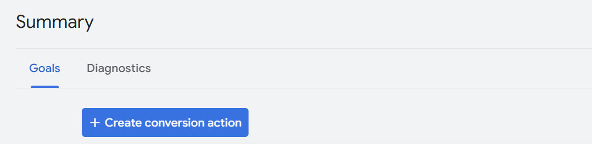

## Step 1 - Access Google Ads
1. In the **left navbar**, go to **Goals > Summary**.
   

## Step 2 - Create a Conversion Action
1. Click on **"+ Create conversion action"**.
   
2. Alternatively, click **"+" (Create)** in the left navbar > Conversion Action.

## Step 3 - Select Website Option
1. Choose **Website** as the conversion source.

## Step 4 - Enter and Scan Your Domain
1. Input your **website domain** and click **Scan**.

:::danger
**Important:** Do **not** use **Google Analytics** measurement. If you do, your conversion **will not trigger**.
:::

## Step 5 - Manually Add Conversions
1. Click on **"Add Conversions Manually"**.

## Step 6 - Follow Google Ads Instructions
1. Follow the setup instructions provided by Google Ads and click **Done**.

## Step 7 - Configure Tag Setup
1. When prompted, select **"Use Google Tag Manager"**.

## Step 8 - Retrieve Conversion Details
1. Copy your **Conversion ID** and **Conversion Label**.
2. Save them for later use.
