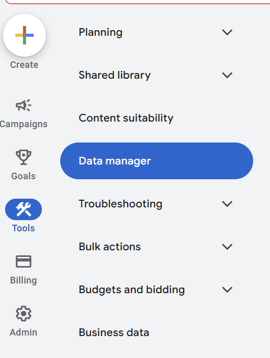
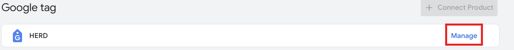
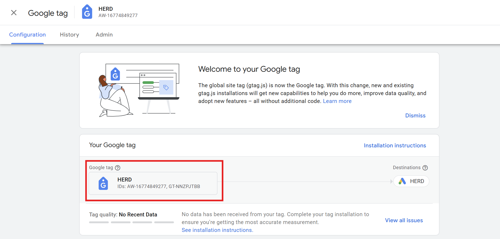
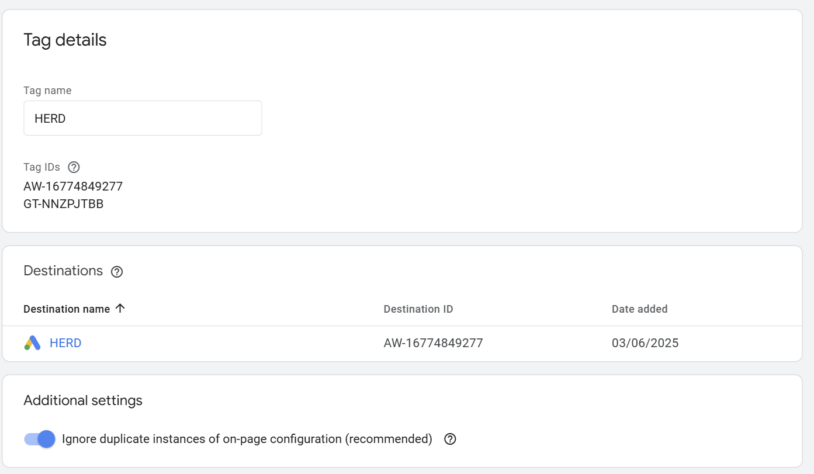
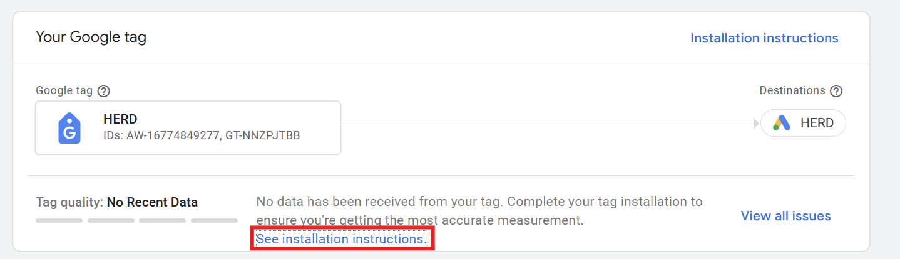

:::info 
<b>IMPORTANT</b>
:::

## Option 1: Retrieve the id
1. Go to the Google Ads account.
2. Click on the Tools Icon.
3. Click Data Manager.
    
4. Under Google Tag - click on "manage"
    
5. Click the Google Tag.
    
6. Now you will be able to see the google tag details.
    
7. Copy the Destination ID.

There you have it.

## Option 2: instructions to retrieve tracking id and connect to your CMS.
    1. Go to the Google Ads account.
    2. Click on the Tools Icon.
    3. Click Data Manager.
    4. Under Google Tag - click on "manage".
    5. Click "See installation instructions".
        
    6. Now you will be prompted to add your URL and desired CMS.
    7. Copy your tracking ID. and follow instructions to connect G-ads to the site.
